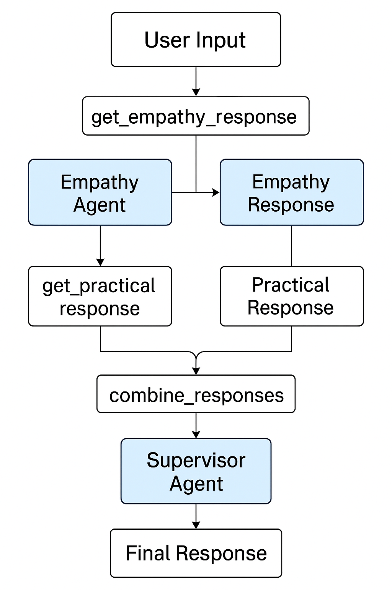

# 🧠Multi Agentic Mind Companion

## Overview
Mind Companion is a Streamlit-based application designed to provide mental wellness support through several interconnected features. It offers a chat interface with an empathetic AI assistant, journaling capabilities, mood tracking, relaxing sounds, and helpful resources.

## Features

### 💬 Chat Support
- Utilizes a multi-agent LLM approach with empathy, practical advice, and supervisor components
- Offers supportive responses that balance emotional validation with actionable suggestions
- Maintains conversation history for continuity across sessions

### 📝 Reflection Journal
- Record daily thoughts and reflections
- Track mood alongside entries
- Add tags for better organization
- Filter and search through past entries

### 📊 Mood Calendar
- Visualize mood patterns over time with a color-coded calendar
- View monthly mood summaries and statistics
- Track progress and identify patterns

### 🎧 Lofi Sounds
- Access relaxing background sounds to help with focus or relaxation
- Simple audio player integrated into the application

### 📚 Resources
- Collection of helpful mental wellness resources and information

## Technical Architecture

The application uses a multi-agent LLM architecture in its chat component:
- **Empathy Agent**: Provides emotional validation and support
- **Practical Agent**: Offers concrete, actionable suggestions when appropriate
- **Supervisor Agent**: Combines the outputs of both agents into natural-sounding responses

Data is stored locally in JSON format, with separate files for user profiles, chat history, and journal entries.

## Setup Instructions

### Prerequisites
- Python 3.7+
- Streamlit
- LangChain
- Local LLM setup (using llama3.2:1b model via localhost:11434)

### Installation

1. Clone the repository
```bash
git clone https://github.com/yourusername/mind-companion.git
cd mind-companion
```

2. Install dependencies
```bash
pip install -r requirements.txt
```

3. Run the application
```bash
streamlit run main.py
```

## User Guide

1. Create a profile or continue as a guest
2. Select your preferred theme
3. Navigate between the different features using the sidebar
4. Your data is stored locally in the `user_data` directory

## Architecture Diagram



## License

This project is licensed under the MIT License - see the LICENSE file for details.

## Acknowledgments

- Built with Streamlit
- Uses LangChain for LLM interactions
- Powered by Llama 3.2
